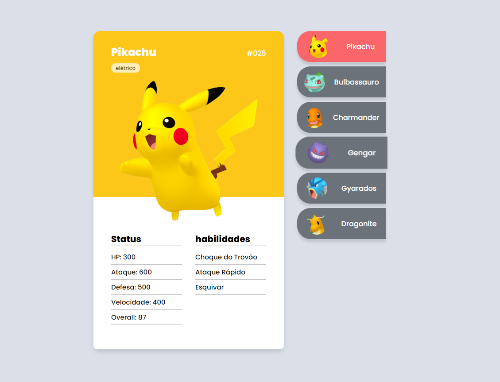
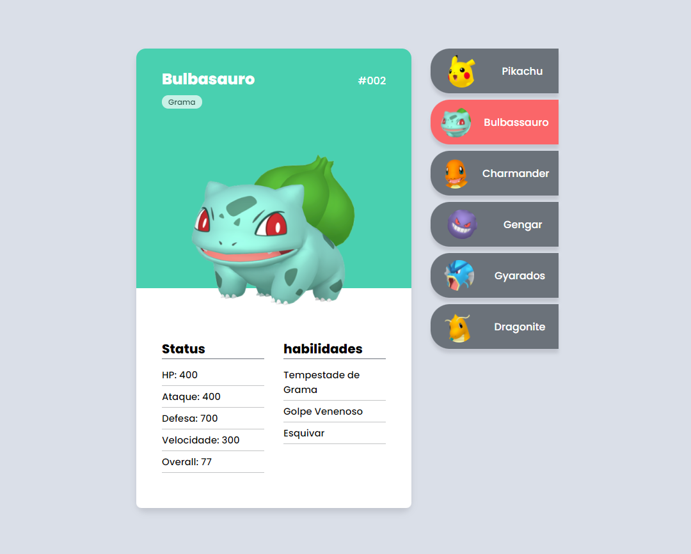
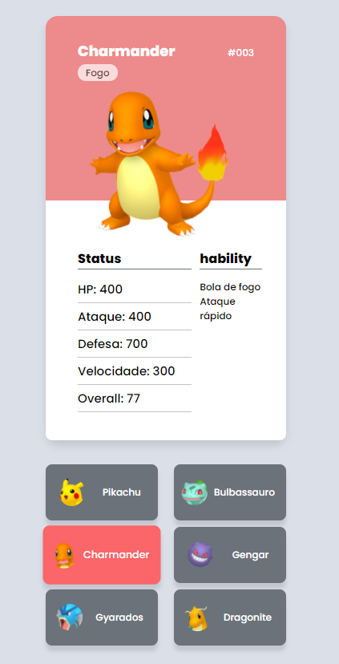

<h3>Projeto utilizando HTML, CSS, e Javascript (Sem utilização de API). Com o intuito de estudo e prática.
Todos os dados de status dos pokemon são ficticios.</h3>

Imagens do Projeto

Versão mobile

